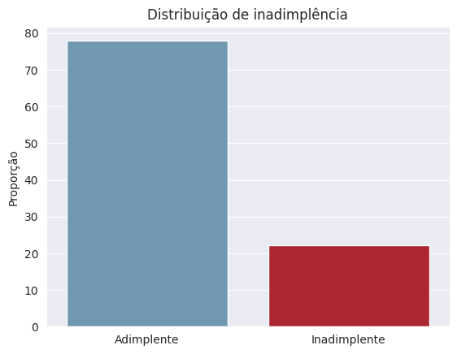
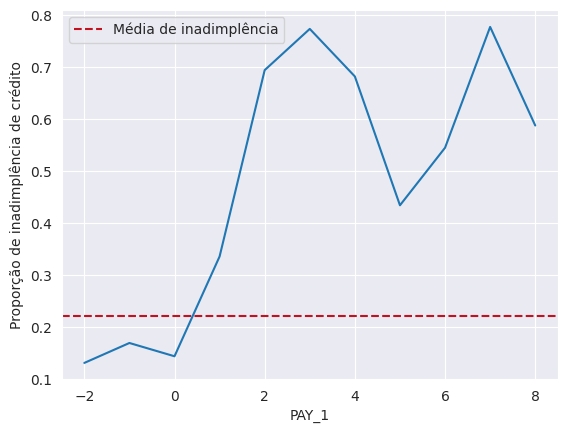
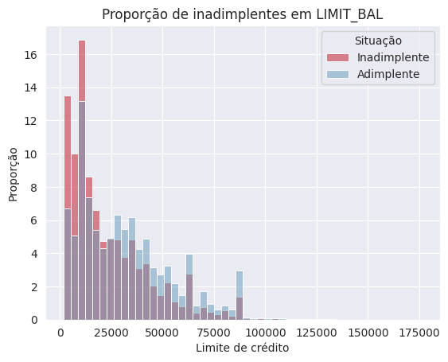
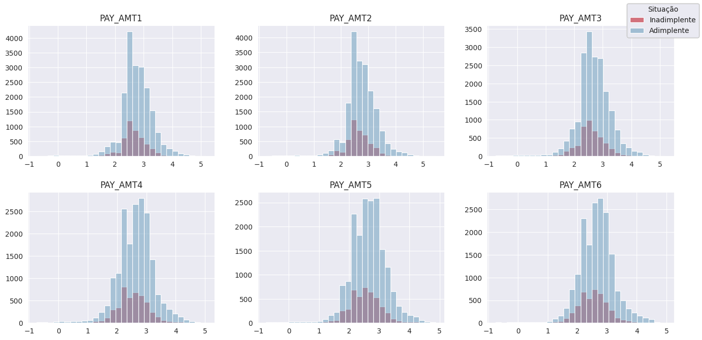
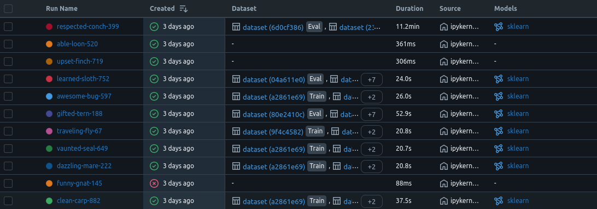

# 📈 Risco de Crédito
[](https://creditriskmodel-mathsnts08.streamlit.app/)

|               |             |
| -----------   | -----------    |
| Autor         | [Matheus Santos](https://www.linkedin.com/in/mathsantos94/) |
| Modelo        | Risco de crédito    |
| Linguagem    | Python    |
| EDA | [Notebook](notebooks/eda.ipynb) |
| Aplicação     | [StreamLit](https://creditriskmodel-mathsnts08.streamlit.app/)    |
| Instalação    | [Clique aqui](https://github.com/Mathsnts18/CreditRiskModel?tab=readme-ov-file#-instala%C3%A7%C3%A3o-do-projeto)    |

## 📝 CRISP-DM

O modelo foi desenvolvido seguindo a metodologia **CRISP-DM**, um framework amplamente adotado em projetos de ciência de dados.

O CRISP-DM serve como um roteiro para organizar e executar projetos de dados, garantindo que todas as etapas críticas sejam consideradas, desde a compreensão do prolema de negócio até a implementação e monitoramento do modelo em produção.

**Etapas:**

1. Business Understanding (Compreensão do Negócio)
2. Data Understanding (Compreensão dos Dados)
3. Data Preparation (Preparação dos Dados)
4. Modeling (Modelagem)
5. Evaluation (Avaliação)
6. Deployment (Implementação)

## 📌 Visão geral 
Esse projeto teve como objetivo identificar potenciais clientes inadimplentes de uma instituição de cartão de crédito. Foram utilizadas técnicas de análise de dados e machine learning para detectar possíveis inadimplências e reduzir prejuízos futuros.

## 💼 Entendimento do Negócio

De acordo com o Instituto Locomotiva e MFM Tecnologia, oito em cada dez famílias brasileiras estiveram endividadas, e um terço teve dívidas em atraso. Os índices, que haviam piorado significativamente durante a pandemia da covid-19, já recuaram, mas ainda são elevados, segundo o relatório.

Um dos principais motivos para a inadimplência foi o cartão de crédito, de acordo com a pesquisa. O meio de pagamento foi a fonte de 60% dos débitos em aberto no ano de 2023. Deixar de liquidar dívidas junto a bancos e financeiras, assim como empréstimos e financiamentos, também tem sido um desafio para grande parte dos brasileiros. Uma parcela de 43% lidou com isso atualmente, proporção que subiu em relação ao ano passado, quando era de 40%.

Essa situação foi prejudicial tanto para os consumidores quanto para as instituições financeiras. Detectar os padrões de consumidores que ficaram inadimplentes nos últimos meses e ter se planejado quanto a isso poderiam ter economizado milhões de reais.

## 💡 Insights e Conclusões

### 1. Introdução

O cliente, uma empresa de cartão de crédito, nos trouxe um dataset que incluiu os dados demográficos e financeiros recentes de uma amostra de 30.000 clientes. Esses dados estiveram no nível de conta de crédito (ou seja, uma linha para cada conta). As linhas foram rotuladas de acordo com se, no mês seguinte ao período de dados históricos de seis meses, um proprietário de conta ficou inadimplente, ou seja, não fez o pagamento mínimo.

**Objetivo**: Nosso objetivo como Cientista de Dados foi desenvolver um modelo, com os dados fornecidos, que previsse se uma conta ficaria inadimplente no próximo mês.

### 2. Os dados

| Feature                       | Descrição |
| ---                           | --- |
| `ID`                          | Coluna de identificação exclusiva da conta |
| `LIMIT_BAL`                   | valor do crédito fornecido inclusive o crédito do consumidor individual e familiar (complementar) |
| `SEX`                         | Gênero (1 = masculino; 2 = feminino) |
| `EDUCATION`                   | Instrução civil (1 = pós-graduação; 2 = universidade; 3 = ensino médio; 4 = outros). |
| `MARRIAGE`                    | Estado civil (1 = casado; 2 = solteiro; 3 = outros). |
| `AGE`                         | Idade (ano). |
| `PAY_1`-`PAY_6`               | Registro do ultimo pagamento. A escala de medida do status de reembolso é a seguinte: -2 = conta começou o mês sem valor a ser pago e o crédito não foi usado; -1 = pagamento pontual; 0 = o pagamento mínimo foi feito, mas o saldo total devedor não foi pago; 1 a 8 = atraso de um a oito mêses no pagamento; 9 = atraso de nove meses ou mais no pagamento. |
| `BILL_AMT1`-`BILL_AMT6`       | Valor da fatura; BILL_AMT1 representa o valor da fatura em setembro; BILL_AMT2 representa o valor da fatura em agosto; e assim por diante até BILL_AMT7, que representa o valor da fatura em abril. |
| `PAY_AMT1`-`PAY_AMT6`         | Valor de pagamentos anteriores; PAY_AMT1 representa o valor pago em setembro; PAY_AMT2 representa o valor pago em agosto; e assim por diante até PAY_AMT6, que representa o valor pago em abril. |
| `default payment next month`  | Inadimplência (Alvo) |

**O dataset conta com:**

- 30000 registros e 25 colunas
- Não há valores nulos ou duplicados

#### Limpeza e manipulação


- Foram identificados e removidos registros com valores zerados em todas as suas features;
- O valor "Not available" da feature `PAY_1` foi alterado para seu valor mais frequente;
- Valores não identificados no dicionário nas features `EDUCATION` e `MARRIAGE` foram alterados para outros;
- Uma nova feature de categoria para `EDUCATION` foi criada;
- Problemas na captura de dados das colunas `PAY_2`, `PAY_3`, `PAY_4`, `PAY_5` e `PAY_6` foram identificados, e por isso, essas colunas foram removidas.

### 3. Análise Exploratória dos Dados

#### `default payment next month`


Uma característica muito comum em problemas de inadimplência foi o desbalanceamento de dados. Em nosso dataset, pôde-se observar que apenas 22% da nossa base foi considerada inadimplente.

#### `PAY_1`


O gráfico acima mostrou uma informação muito importante: quem já havia inadimplido apresentou uma tendência maior de fazê-lo novamente. A taxa de inadimplência de contas que estavam em boa situação ficou bem abaixo da taxa geral, e pelo menos 30% das contas que estavam inadimplentes no último mês ficaram inadimplentes novamente.

#### `LIMIT_BAL`


Aparentemente, contas com limites menores de crédito, de aproximadamente R$ 26.5500, foram relativamente mais propensas a inadimplir. O que fez sentido ao entender que as instituições deram limites menores a contas que apresentavam mais risco de inadimplência.

#### `PAY_AMT`


Os gráficos mostraram uma relação entre as variáveis PAY_AMT e a variável alvo default payment next month. Observou-se que, ao longo do tempo, essa relação foi se tornando menos evidente. Nos pagamentos mais recentes, houve uma distorção na curva para a esquerda, indicando que clientes que realizaram pagamentos menores tiveram uma maior probabilidade de inadimplência.

## 🤖 Modelagem


Neste projeto, utilizamos o MLflow para gerenciar, rastrear e versionar os experimentos de machine learning, garantindo eficiência, reprodutibilidade e transparência no processo.

### O que é o MLflow?

O MLflow é uma plataforma open-source com a função de gerenciar o ciclo de vida de modelos de machine learning. Ele oferece quatro módulos principais:

- **MLflow Tracking**: Registro de métricas, parâmetros e artefatos de experimentos.

- **MLflow Projects**: Empacotamento de código para facilitar a reprodução de experimentos.

- **MLflow Models**: Padronização do formato de modelos para deploy.

- **MLflow Registry**: Versionamento e gerenciamento de modelos em produção.

### Utilização no projeto

Durante a fase de modelagem, testamos diversos algoritmos (Regressão Logística, Random Forest, AdaBoosting, XGBoost, entre outros) e combinações de hiperparâmetros. O MLflow doi utilizado para registrar as métricas, armazenar parâmetros, salvar artefatos importantes dos modelos treinados e versionamento dos modelos.

O uso do MLflow garantiu a organização, rastreabilidade e reprodutibilidade e comparação dos diversos modelos treinados, facilitando a análise e tomadas de decisão.

## 💸 Análise financeira

O modelo de risco de crédito desenvolvido permite uma estratégia proativa de gerenciamento de inadimplência, combinando inteligência de dados com intervenções financeiramente viáveis.

Para fazer uma análise financeira, foi suposto o caso de que, para as contas de crédito que estivessem em alto risco de inadimplência, seria oferecido um aconselhamento ao titular, que custaria R$ 1.300,00 para a empresa, com uma taxa de sucesso esperada de 70% para que pagassem sua dívida a tempo ou fizessem acordos alternativos. Os possíveis benefícios do aconselhamento bem-sucedido foram que o valor da cobrança mensal de uma conta foi percebido como economia, caso ela fosse ficar inadimplente, mas não ficou como resultado da conversa.


## 💻 Instalação do projeto

**Prerequisitos**
Antes de começar, tenha certeza que você tem instalado em sua maquina:

- Python 3.10
- pip
- Git

Uma vez instalado, abra o terminal na sua maquina local e siga os passos:

1. Clone o repositorio

```
git clone https://github.com/Mathsnts18/CreditRiskModel.git
```
2. Vá ao diretório clonado

```
cd CreditRiskModel
```

3. Crie um ambiente virtual

```
python -m venv venv
```

4. Ative o ambiente virtual

Ative o ambiente virtual para isolar as dependências do projeto
```
# no Windows
venv\Scripts\activate

# no Linux
source venv/bin/activate
```

5. Instale as dependências

Use o pip para instalar as dependências listadas no requirements.txt

```
pip install -r requirements.txt
```

6. Execute a aplicação

```
streamlit run app.py
```
Após a execução, o projeto irá abrir automaticamente. Caso isso não aconteça, digite na barra de endereço do seu navegar o `Local URL` informado no terminal

7. Desligue a aplicação

Para desligar a aplicação, dê o comando `Ctrl+C` no terminal que estiver rodando a aplicação.

8. Desative o ambiente virtual

Quando terminar de ver o projeto, desative o ambiente virtual

```
deactivate
```

## Contato

Portfólio: https://www.matheussantos.com.br/

Linkedin: https://www.linkedin.com/in/mathsantos94/

Github:https://github.com/Mathsnts18

Gmail: msantos18.ms@gmail.com

